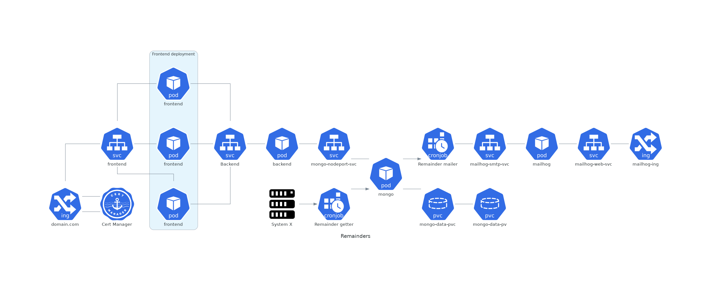

# Remainders Kubernetes demo

Training environment for the development of Kubernetes-based service using Golang, React and Python.

Reminders is a service that allows you to browse automated emails sent to users. The production version of the system (on premises fork) has been integrated into Primus student information system on the Riveria school.

## Diagram

- on progress

## Key components

- remainders-backend REST-service, https://github.com/pasiol/remainders-backend
- remainders-frontend React frontend, Lauri Ruuskanen on an internship at Riveria School, https://github.com/lauriruusk/remainders-frontend
- test data generator, https://github.com/pasiol/remainders-testdata
- remainders-user, Cobra based cli utility to create users for frontend, https://github.com/pasiol/remainders-user

## Demo environment

- Windows 11, Docker for Desktop Kubernetes cluster

TODO:

- Docker environment for backend testing
- automated Python service for initializing database and loading test data
- kustomization
- SMTP support, mailhog deployment
- self signed cert on local deployment using Cert Manager
- monitoring Prometheus
- securing cluster
- branch for MongoDB cluster on the Kubernetes cluster 
- branch for Atlas operator
- branches for Let's Encrypt support on the Cert Manager on DO, GKE and Azure